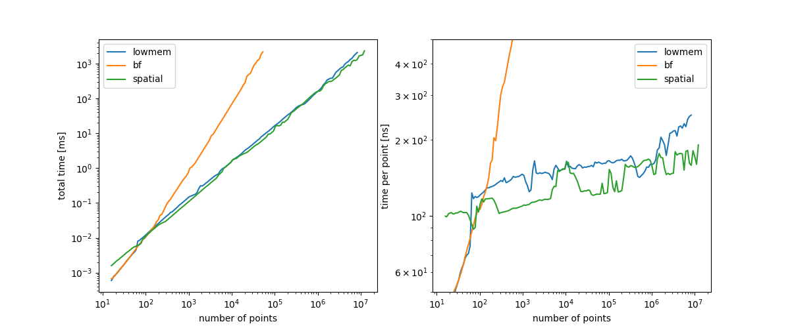

# collide3 v1.0.2


A collisions detector for points/spheres in $`[-1,1]^3`$ with equal
radii. Used in [chromflock](https://www.github.com/elgw/chromflock).

The implementation combines spatial hashing/spatial partitioning (each
bin corresponds to a 3D box) with [counting
sort](https://en.wikipedia.org/wiki/Counting_sort) to generate a hash
table with a load factor of 100%. Good performance can only be
expected when the points are somewhat uniformly distributed.

The "demo" image above was generated with
``` shell
make ; ./test_collide3_f32 --chimera --npoint 10000; chimerax test.cmm
```

## API and Usage

See `collide3.h` for the latest version and usage notes. In essence:
the interface asks for a list of points and a callback function to
be used on each collision. See also the file `test/test_collide3.c`
for examples.

``` c
int
collide3_f32(const float * points,
         uint32_t n_point,
         float collision_distance,
         collide3_info * info,
         collide3_cb cb, void * cb_data);
```

## Performance indicators

This tests uses close-to ideal inputs, please perform your own
benchmarks if you plan to use this library.

Points were uniformly random distributed in $`[-1,1]^3`$ and the
collision distance was set to $`2n^{-1/3}`$ ($`2r`$ in terms of beads).

For 32-bit floating points:

| method   |          N | t_construct [ms] | t_scan [ms] | t_total [ms] | mem [kb] |
|----------|-----------:|-----------------:|------------:|-------------:|---------:|
| collide3 |      1,024 |            0.008 |       0.128 |        0.136 |       17 |
| collide3 |      2,048 |            0.017 |       0.262 |        0.279 |       34 |
| collide3 |      4,096 |            0.034 |       0.535 |        0.568 |       68 |
| collide3 |      8,192 |            0.116 |       1.096 |        1.212 |      136 |
| collide3 |     16,384 |            0.255 |       2.218 |        2.474 |      273 |
| collide3 |     32,768 |            0.531 |       4.473 |        5.004 |      548 |
| collide3 |     65,536 |            0.729 |       9.005 |        9.734 |    1,097 |
| collide3 |    131,072 |            1.660 |      18.135 |       19.794 |    2,195 |
| collide3 |    262,144 |            4.213 |      35.875 |       40.088 |    4,397 |
| collide3 |    524,288 |           10.007 |      71.856 |       81.863 |    8,804 |
| collide3 |  1,048,576 |           25.444 |     146.180 |      171.624 |   17,599 |
| collide3 |  2,097,152 |           60.182 |     272.476 |      332.659 |   35,175 |
| collide3 |  4,194,304 |          121.611 |     489.216 |      610.827 |   70,431 |
| collide3 |  8,388,608 |          311.401 |     982.835 |    1,294.236 |  140,790 |
| collide3 | 16,777,216 |          916.627 |   2,063.265 |    2,979.892 |  281,667 |

By default `collide3` use brute force (`be_brute_force`)
for small problems and switches to `be_spatial` when there are 100
points or more.

That is based on the following timings:




<details><summary>Results 64-bit floating points</summary>

| method   |          N | t_construct [ms] | t_scan [ms] | t_total [ms] | mem [kb] |
|----------|-----------:|-----------------:|------------:|-------------:|---------:|
| collide3 |      1,024 |            0.006 |       0.111 |        0.118 |       33 |
| collide3 |      2,048 |            0.014 |       0.230 |        0.244 |       67 |
| collide3 |      4,096 |            0.073 |       0.475 |        0.548 |      134 |
| collide3 |      8,192 |            0.165 |       0.956 |        1.121 |      267 |
| collide3 |     16,384 |            0.127 |       1.931 |        2.058 |      535 |
| collide3 |     32,768 |            0.283 |       3.928 |        4.210 |    1,072 |
| collide3 |     65,536 |            0.766 |       7.939 |        8.705 |    2,146 |
| collide3 |    131,072 |            1.753 |      15.898 |       17.652 |    4,292 |
| collide3 |    262,144 |            6.173 |      32.835 |       39.008 |    8,591 |
| collide3 |    524,288 |           14.822 |      65.993 |       80.815 |   17,193 |
| collide3 |  1,048,576 |           38.775 |     133.544 |      172.319 |   34,376 |
| collide3 |  2,097,152 |           78.463 |     253.918 |      332.381 |   68,730 |
| collide3 |  4,194,304 |          171.749 |     527.794 |      699.543 |  137,540 |
| collide3 |  8,388,608 |          410.715 |   1,029.465 |    1,440.180 |  275,008 |
| collide3 | 16,777,216 |        1,001.874 |   1,936.698 |    2,938.572 |  550,103 |


</details>

## Comparisons


A [k-d tree](https://en.wikipedia.org/wiki/K-d_tree) can of course
also be used for the same problem (having much broader applicability).

Just to have some reference point I've run
[`scipy.spatial.KDTree`](https://docs.scipy.org/doc/scipy/reference/spatial.html)
with similar input as above (see `test/test_scipy_spatial_KDTree.py`),
which boils down to:

``` Python
tree = KDTree(X)
# k is the 3D kissing number
results = tree.query(X, k=12, p=2, distance_upper_bound=radius)
```

Results:

| method |          N | t_construct [ms] | t_scan [ms] | t_total [ms] | mem [kb] |
|--------|-----------:|-----------------:|------------:|-------------:|---------:|
| KDTree |      1,024 |             0.22 |        0.94 |         1.16 |          |
| KDTree |      2,048 |             0.45 |        1.96 |         2.41 |          |
| KDTree |      4,096 |             0.84 |        3.84 |         4.68 |          |
| KDTree |      8,192 |             1.73 |        8.09 |         9.82 |          |
| KDTree |     16,384 |             3.83 |       17.95 |        21.79 |          |
| KDTree |     32,768 |             9.11 |       41.76 |        50.88 |          |
| KDTree |     65,536 |            20.39 |       88.60 |       108.99 |          |
| KDTree |    131,072 |            42.82 |      180.69 |       223.51 |          |
| KDTree |    262,144 |            79.05 |      404.80 |       483.86 |          |
| KDTree |    524,288 |           178.63 |    1,392.75 |     1,571.38 |          |
| KDTree |  1,048,576 |           511.71 |    3,403.33 |     3,915.05 |          |
| KDTree |  2,097,152 |           973.00 |    7,075.86 |     8,048.86 |          |
| KDTree |  4,194,304 |         2,212.09 |   15,661.35 |    17,873.44 |          |
| KDTree |  8,388,608 |         4,756.68 |   33,342.59 |    38,099.27 |          |
| KDTree | 16,777,216 |        11,126.19 |   69,749.39 |    80,875.58 |          |

Changing the data type of the input array from `np.float64` to
`np.float32` did not seem alter the timings.

## Notes/ Relevant links / See also

- The tests were performed with an AMD Ryzen 7 3700X 8-Core Processor using GCC 13.3.0.

- The visualization above was made with [UCSF ChimeraX](https://www.cgl.ucsf.edu/chimerax/).

- [`scipy.spatial.KDTree`](https://docs.scipy.org/doc/scipy/reference/spatial.html)

- I'd be happy to list your alternative here.
