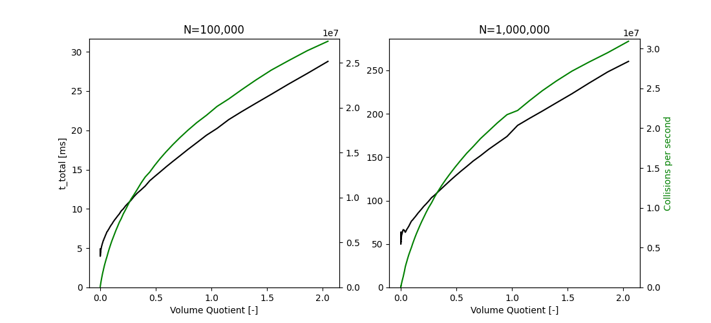

# collide3 v1.0.4


A collisions detector for points/spheres in $`[-1,1]^3`$ with equal
radii. Used in [chromflock](https://www.github.com/elgw/chromflock).

The implementation combines spatial hashing/spatial partitioning (each
bin corresponds to a 3D box) with [counting
sort](https://en.wikipedia.org/wiki/Counting_sort) to generate a hash
table with a load factor of 100%. Good performance can only be
expected when the points are somewhat uniformly distributed.

The "demo" image above was generated with
``` shell
make ; ./test_collide3_f32 --chimera --npoint 10000; chimerax test.cmm
```

## API and Usage

See `collide3.h` for the latest version and usage notes. In essence:
the interface asks for a list of points and a callback function to
be used on each collision. See also the file `test/collide3_test.c`
for examples.

``` c
int
collide3_f32(const float * points,
         uint32_t n_point,
         float collision_distance,
         collide3_info * info,
         collide3_cb cb, void * cb_data);
```

## Performance indicators

This test use randomly distributed points in $`[-1,1]^3`$.  The bead
radius $`r`$ was set so that the volume quotient
$`V_{beads}/V_{domain}`$ is $`0.1`$, the collision distance
(between the beads centers) as $`2r`$. Smaller beads will of course
result in faster run-times and vice versa.

For 32-bit floating points:

| method   |          N | t_construct [ms] | t_scan [ms] | t_total [ms] |  mem [kb] |
|----------|-----------:|-----------------:|------------:|-------------:|----------:|
| collide3 |      1,024 |            0.009 |       0.044 |        0.053 |        17 |
| collide3 |      2,048 |            0.017 |       0.091 |        0.108 |        34 |
| collide3 |      4,096 |            0.034 |       0.184 |        0.218 |        68 |
| collide3 |      8,192 |            0.068 |       0.375 |        0.443 |       135 |
| collide3 |     16,384 |            0.250 |       0.755 |        1.005 |       271 |
| collide3 |     32,768 |            0.409 |       1.532 |        1.941 |       541 |
| collide3 |     65,536 |            0.648 |       3.077 |        3.726 |     1,086 |
| collide3 |    131,072 |            1.347 |       6.206 |        7.553 |     2,167 |
| collide3 |    262,144 |            3.164 |      12.468 |       15.632 |     4,338 |
| collide3 |    524,288 |            9.519 |      25.318 |       34.838 |     8,685 |
| collide3 |  1,048,576 |           25.178 |      50.639 |       75.816 |    17,373 |
| collide3 |  2,097,152 |           62.319 |     103.934 |      166.253 |    34,704 |
| collide3 |  4,194,304 |          136.384 |     207.524 |      343.908 |    69,480 |
| collide3 |  8,388,608 |          335.275 |     420.465 |      755.740 |   138,982 |
| collide3 | 16,777,216 |          915.160 |     835.824 |    1,750.984 |   277,846 |
| collide3 | 33,554,432 |        2,508.848 |   1,757.456 |    4,266.304 |   555,837 |
| collide3 | 67,108,864 |        5,721.446 |   3,511.346 |    9,232.792 | 1,111,854 |


By default `collide3` use brute force (`be_brute_force`)
for small problems and switches to `be_spatial` when there are 60
points or more. That is based on the following timings:


Some clues about the relation between the collision radius and
performance can be seen here:



<details><summary>Results 64-bit floating points</summary>

| method   |          N | t_construct [ms] | t_scan [ms] | t_total [ms] |  mem [kb] |
|----------|-----------:|-----------------:|------------:|-------------:|----------:|
| collide3 |      1,024 |            0.010 |       0.052 |        0.062 |        33 |
| collide3 |      2,048 |            0.019 |       0.103 |        0.123 |        66 |
| collide3 |      4,096 |            0.036 |       0.195 |        0.231 |       133 |
| collide3 |      8,192 |            0.070 |       0.381 |        0.451 |       266 |
| collide3 |     16,384 |            0.150 |       0.767 |        0.917 |       533 |
| collide3 |     32,768 |            0.321 |       1.563 |        1.884 |     1,065 |
| collide3 |     65,536 |            0.671 |       3.138 |        3.809 |     2,134 |
| collide3 |    131,072 |            1.580 |       6.320 |        7.900 |     4,265 |
| collide3 |    262,144 |            4.963 |      12.796 |       17.759 |     8,532 |
| collide3 |    524,288 |           15.144 |      26.097 |       41.240 |    17,074 |
| collide3 |  1,048,576 |           40.002 |      54.451 |       94.453 |    34,150 |
| collide3 |  2,097,152 |           85.960 |     110.609 |      196.569 |    68,259 |
| collide3 |  4,194,304 |          209.250 |     265.775 |      475.025 |   136,589 |
| collide3 |  8,388,608 |          509.513 |     493.667 |    1,003.180 |   273,200 |
| collide3 | 16,777,216 |        1,343.329 |     892.661 |    2,235.990 |   546,281 |
| collide3 | 33,554,432 |        3,549.420 |   1,907.915 |    5,457.335 | 1,092,708 |
| collide3 | 67,108,864 |        8,516.847 |   3,822.702 |   12,339.549 | 2,185,596 |


</details>

## Comparisons


A [k-d tree](https://en.wikipedia.org/wiki/K-d_tree) can of course
also be used for the same problem (having much broader applicability).

Just to have some reference point I've run
[`scipy.spatial.KDTree`](https://docs.scipy.org/doc/scipy/reference/spatial.html)
with similar input as above (see `test/scipy_spatial_KDTree_test.py`),
which boils down to:

``` Python
tree = KDTree(X)
results = tree.query(X, k=2, p=2, distance_upper_bound=detection_distance)
```

Results:

| method |         N | t_construct [ms] | t_scan [ms] | t_total [ms] | mem [kb] |
|--------|----------:|-----------------:|------------:|-------------:|---------:|
| KDTree |     1,024 |            0.224 |       0.590 |        0.814 |          |
| KDTree |     2,048 |            0.428 |       1.135 |        1.564 |          |
| KDTree |     4,096 |            0.896 |       2.502 |        3.398 |          |
| KDTree |     8,192 |            1.734 |       4.830 |        6.564 |          |
| KDTree |    16,384 |            3.666 |      10.389 |       14.055 |          |
| KDTree |    32,768 |            8.218 |      23.239 |       31.457 |          |
| KDTree |    65,536 |           20.785 |      53.978 |       74.762 |          |
| KDTree |   131,072 |           42.853 |     110.646 |      153.500 |          |
| KDTree |   262,144 |           89.353 |     264.876 |      354.229 |          |
| KDTree |   524,288 |          183.615 |     839.618 |    1,023.233 |          |
| KDTree | 1,048,576 |          450.215 |   2,031.953 |    2,482.168 |          |
| KDTree | 2,097,152 |        1,013.275 |   4,512.824 |    5,526.099 |          |
| KDTree | 4,194,304 |        2,178.211 |   9,514.155 |   11,692.366 |          |
| KDTree | 8,388,608 |        4,995.838 |  20,391.409 |   25,387.246 |          |


Changing the data type of the input array from `np.float64` to
`np.float32` did not seem alter the timings.

## Notes/ Relevant links / See also

- The tests were performed with an AMD Ryzen 7 3700X 8-Core Processor using GCC 13.3.0.

- The visualization above was made with [UCSF ChimeraX](https://www.cgl.ucsf.edu/chimerax/).

- [`scipy.spatial.KDTree`](https://docs.scipy.org/doc/scipy/reference/spatial.html)

- I'd be happy to list your alternative here.
