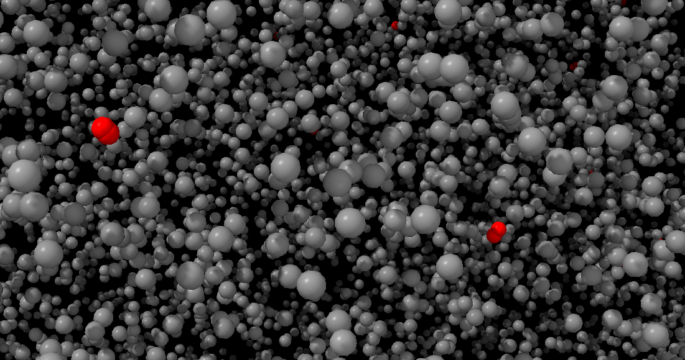

# collide3 v1.0.2

<figure>

 <figcaption>`make ; ./test_collide3_f32 --chimerax; chimerax test.cmm`</figcaption>
</figure>

A collisions detector for points/spheres in $`[-1,1]^3`$ with equal
radii. Used in [chromflock](https://www.github.com/elgw/chromflock).

The implementation combines spatial hashing/spatial partitioning (each
bin corresponds to a 3D box) with [counting
sort](https://en.wikipedia.org/wiki/Counting_sort) to generate a hash
table with a load factor of 100%. Good performance can only be
expected when the points are somewhat uniformly distributed.

## API and Usage

See `collide3.h` for the latest version and usage notes. In essence:
if the interface asks for a list of points and a callback function to
be used on each collision. See also the file `test/test_collide3.c`
for examples.

``` c
int
collide3_f32(const float * points,
         uint32_t n_point,
         float collision_distance,
         collide3_info * info,
         collide3_cb cb, void * cb_data);
```

## Performance indicators

This tests uses close-to ideal inputs, please perform your own
benchmarks if you plan to use this library.

Points were uniformly random distributed in $`[-1,1]^3`$ and the
collision distance was set to $`2n^{-1/3}`$ ($`2r`$ in terms of beads).

For 32-bit floating points:

| method   |          N | t_construct [ms] | t_scan [ms] | t_total [ms] |   mem [kb] |
|----------|-----------:|-----------------:|------------:|-------------:|-----------:|
| collide3 |      1,024 |             0.01 |        0.01 |         0.02 |      16.90 |
| collide3 |      2,048 |             0.02 |        0.03 |         0.04 |      34.15 |
| collide3 |      4,096 |             0.03 |        0.06 |         0.09 |      68.46 |
| collide3 |      8,192 |             0.11 |        0.10 |         0.21 |     136.41 |
| collide3 |     16,384 |             0.22 |        0.19 |         0.40 |     273.13 |
| collide3 |     32,768 |             0.53 |        0.43 |         0.96 |     547.63 |
| collide3 |     65,536 |             0.66 |        0.87 |         1.53 |   1,097.26 |
| collide3 |    131,072 |             1.41 |        1.73 |         3.14 |   2,194.72 |
| collide3 |    262,144 |             2.94 |        2.99 |         5.93 |   4,396.93 |
| collide3 |    524,288 |             7.33 |        5.71 |        13.05 |   8,803.91 |
| collide3 |  1,048,576 |            19.34 |       11.57 |        30.91 |  17,598.74 |
| collide3 |  2,097,152 |            60.87 |       29.13 |        90.00 |  35,175.34 |
| collide3 |  4,194,304 |           133.64 |       56.66 |       190.30 |  70,431.21 |
| collide3 |  8,388,608 |           336.98 |      109.59 |       446.56 | 140,789.87 |
| collide3 | 16,777,216 |           973.58 |      246.32 |     1,219.90 | 281,667.26 |

<details><summary>Results 64-bit floating points</summary>

| method   |          N | t_construct [ms] | t_scan [ms] | t_total [ms] |   mem [kb] |
|----------|-----------:|-----------------:|------------:|-------------:|-----------:|
| collide3 |      1,024 |             0.01 |        0.01 |         0.03 |      33.28 |
| collide3 |      2,048 |             0.03 |        0.02 |         0.05 |      66.92 |
| collide3 |      4,096 |             0.06 |        0.05 |         0.11 |     134.00 |
| collide3 |      8,192 |             0.10 |        0.08 |         0.19 |     267.48 |
| collide3 |     16,384 |             0.22 |        0.17 |         0.40 |     535.28 |
| collide3 |     32,768 |             0.46 |        0.35 |         0.80 |   1,071.92 |
| collide3 |     65,536 |             0.92 |        0.72 |         1.63 |   2,145.83 |
| collide3 |    131,072 |             2.34 |        1.55 |         3.89 |   4,291.87 |
| collide3 |    262,144 |             5.46 |        3.14 |         8.59 |   8,591.23 |
| collide3 |    524,288 |            13.16 |        6.14 |        19.30 |  17,192.52 |
| collide3 |  1,048,576 |            39.60 |       13.41 |        53.01 |  34,375.96 |
| collide3 |  2,097,152 |            93.16 |       29.01 |       122.17 |  68,729.77 |
| collide3 |  4,194,304 |           217.87 |       58.82 |       276.68 | 137,540.08 |
| collide3 |  8,388,608 |           523.94 |      117.17 |       641.10 | 275,007.60 |
| collide3 | 16,777,216 |         1,539.67 |      219.36 |     1,759.03 | 550,102.72 |

</details>

## Comparisons


A [k-d tree](https://en.wikipedia.org/wiki/K-d_tree) can of course
also be used for the same problem (having much broader applicability).

Just to have some reference point I've run
[`scipy.spatial.KDTree`](https://docs.scipy.org/doc/scipy/reference/spatial.html)
with similar input as above (see `test/test_scipy_spatial_KDTree.py`),
which boils down to:

``` Python
tree = KDTree(X)
# k is the 3D kissing number
results = tree.query(X, k=12, p=2, distance_upper_bound=radius)
```

Results:

| method |          N | t_construct [ms] | t_scan [ms] | t_total [ms] | mem [kb] |
|--------|-----------:|-----------------:|------------:|-------------:|---------:|
| KDTree |      1,024 |             0.22 |        0.94 |         1.16 |          |
| KDTree |      2,048 |             0.45 |        1.96 |         2.41 |          |
| KDTree |      4,096 |             0.84 |        3.84 |         4.68 |          |
| KDTree |      8,192 |             1.73 |        8.09 |         9.82 |          |
| KDTree |     16,384 |             3.83 |       17.95 |        21.79 |          |
| KDTree |     32,768 |             9.11 |       41.76 |        50.88 |          |
| KDTree |     65,536 |            20.39 |       88.60 |       108.99 |          |
| KDTree |    131,072 |            42.82 |      180.69 |       223.51 |          |
| KDTree |    262,144 |            79.05 |      404.80 |       483.86 |          |
| KDTree |    524,288 |           178.63 |    1,392.75 |     1,571.38 |          |
| KDTree |  1,048,576 |           511.71 |    3,403.33 |     3,915.05 |          |
| KDTree |  2,097,152 |           973.00 |    7,075.86 |     8,048.86 |          |
| KDTree |  4,194,304 |         2,212.09 |   15,661.35 |    17,873.44 |          |
| KDTree |  8,388,608 |         4,756.68 |   33,342.59 |    38,099.27 |          |
| KDTree | 16,777,216 |        11,126.19 |   69,749.39 |    80,875.58 |          |
|        |            |                  |             |              |          |

The timings look the same regardless if the input is `np.float32` or `np.float64`.

## See also

You tell me. I'd be happy to list your better alternative here.
